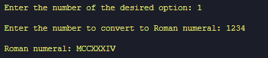

# Roman Numeral Converter

A Python script that allows you to convert numbers to Roman numerals and vice versa.
<br>

## Features

- **Convert to Roman Numeral**: Enter a number, and the script will convert it to a Roman numeral.
- **Convert to Number**: Enter a Roman numeral, and the script will convert it to a number.
- **User-Friendly Menu**: Easy-to-use menu for quick conversions.
- **Colorful Output**: Utilizes the Colorama library for colorful terminal output.

## How to Use

1. **Clone the Repository:**
   ```bash
   git clone https://github.com/sondercs/Roman-Numeral-Converter.git
   cd Roman-Numeral-Converter
2. **Run the Script:**
   ```bash
   python roman_converter.py

3.***Follow the On-Screen Instructions:***

  - **Select option 1 to convert a number to a Roman numeral.**
  - **Select option 2 to convert a Roman numeral to a number.**
  - **Select option 3 to exit the program.**

## Requirements
  - Python 3.12
  - Colorama library (pip install colorama)
